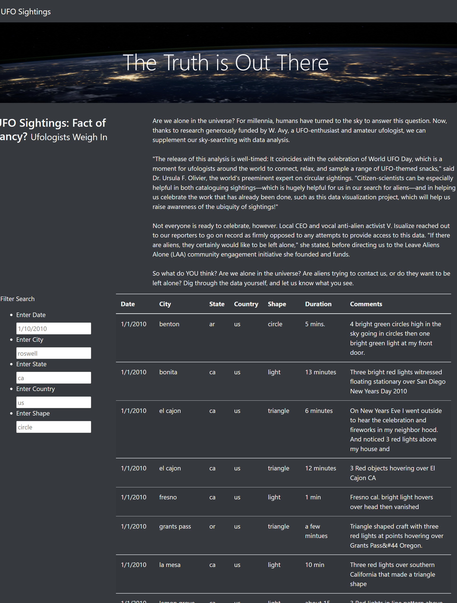
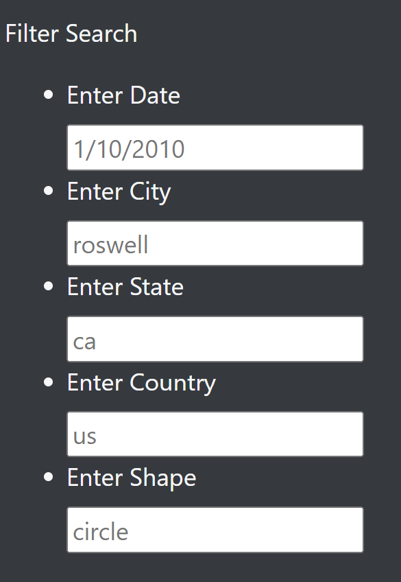
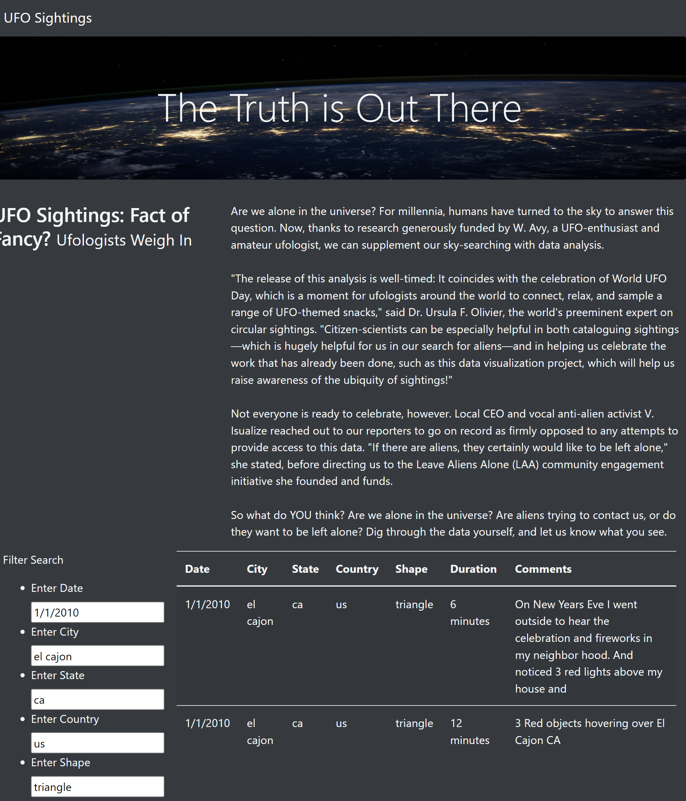

# UFOs

## Overview

The objective of this module (**Module 11: UFO Sightings with JavaScript**) is to create a dynamic webpage with reported UFO sightsings. The webpage welcomes its users with a brief article that reflects about our role in the universe. A table with UFO sightsing details is followed at the bottom of the site. The webpage accepts multiple user inputs that serve as data filters for the results to be displayed.

## Resources

### List of Applications Used

* *HTML5*
* *JavaScript v8*
* *CSS 3*
* *BootStrap v5.2*

### Input Datasets

* **[Starter Code](https://2u-data-curriculum-team.s3.amazonaws.com/dataviz-online/module_11/ufo_starterCode.js)**.
* **[Input Data](https://2u-data-curriculum-team.s3.amazonaws.com/dataviz-online/module_11/data.js)**

## Deliverables

The following is the list of the requested and the provided deliverable files for this modules's challenge.

### Requested Deliverables:

**Deliverable 1:** Filter UFO sightings on multiple criteria.
**Deliverable 2:** A written report on the UFO analysis.

### Provided Deliverables:

**Deliverable 1:** **[HTML Code](./index.html)**, **[JavaScript Code](./static/js/app.js)*, **[CSS Code](./static/css/style.css)**.

**Deliverable 2:** **[README File](./README.md)**.

## Results

The UFO webpage can be accessed by simply opening the provided *index.html* file using a *Chrome* web browser.

*Image 01: UFO sightsings main page.*

The user can input up to five different filters for the UFO sightsing data to be displayed

*Image 02: Data filters.*

Once a data filter has been entered, the webpage will automatically refresh the table to only display the filtered results.

*Image 03: Filtered results.*

## Summary

One drawback of this webpage design is that the user has to be very specific when entering the data filters. For example, if a field is entered with a capital letter, then nothing will be returned as all the data is expected to be entered in lowecase, additionally, the meaning of the "shape" field is somehow ambiguous.

One recommendation would be include an option to export filtered or unfiltered results to a text file. Another feature that would be nice to implement is a dynamic visual element, such as a *google map* window to mark the location(s) of the filtered results.